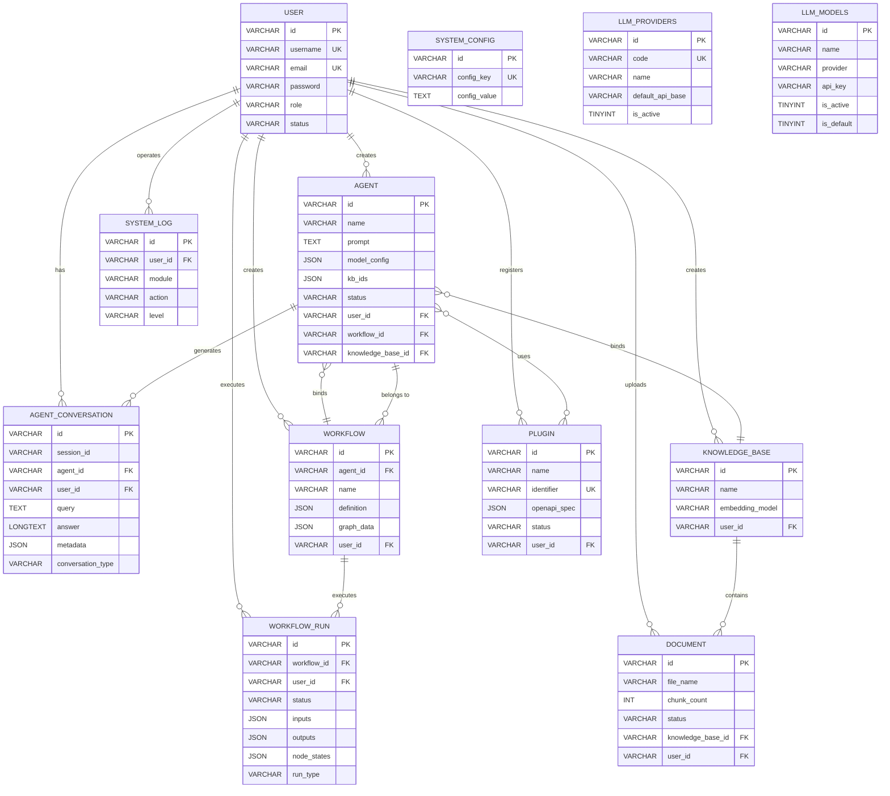

# 智能体创作平台数据库设计文档

## 1. 表设计概览

| 表名 | 核心功能 | 关联用户故事 |
|------|----------|--------------|
| `user` | 存储用户账号信息及认证数据 | US-019, US-020, US-021 |
| `agent` | 存储智能体基本信息及配置 | US-001, US-002, US-003, US-004, US-005, US-017, US-022 |
| `agent_conversation` | 存储智能体对话历史记录 | US-004, US-018 |
| `workflow` | 存储工作流定义及状态 | US-011, US-012, US-013 |
| `workflow_run` | 存储工作流执行历史、状态和调试信息 | US-012, US-013 |
| `knowledge_base` | 存储知识库基本信息 | US-006, US-008, US-010 |
| `document` | 存储知识库关联的文档信息 | US-007, US-008 |
| `plugin` | 存储插件注册信息及状态 | US-014, US-015, US-016 |
| `system_log` | 存储系统操作日志及审计信息 | US-023 |
| `system_config` | 存储系统全局配置信息 | US-022 |
| `llm_providers` | 存储LLM提供商信息 | US-022 |
| `llm_models` | 存储LLM模型配置信息 | US-022 |

## 2. 详细表设计

### 2.1 user 表（用户表）

#### 设计理由
用于存储用户的账号信息、认证数据及个人资料，支持用户注册、登录、个人信息管理等功能，是系统所有资源的权限控制基础，对应用户管理模块的所有用户故事。

#### 字段设计

| 字段名 | 类型 | 约束 | 含义 |
|--------|------|------|------|
| `id` | VARCHAR(64) | PRIMARY KEY | 用户唯一标识 |
| `username` | VARCHAR(50) | NOT NULL, UNIQUE | 用户名（必填,用于登录,US-019注册功能） |
| `email` | VARCHAR(100) | NOT NULL, UNIQUE | 邮箱地址（必填,用于登录和验证,US-019注册功能） |
| `password` | VARCHAR(255) | NOT NULL | 密码（加密存储,US-019注册、US-021修改密码） |
| `nickname` | VARCHAR(100) | NULL | 昵称（可选，US-021个人资料编辑） |
| `avatar` | VARCHAR(512) | NULL | 头像URL（可选，US-021个人资料编辑） |
| `avatar_url` | VARCHAR(500) | NULL | 头像URL（别名字段，与avatar保持一致） |
| `bio` | TEXT | NULL | 个人简介（可选，US-021个人资料编辑） |
| `role` | VARCHAR(20) | NOT NULL, DEFAULT 'user' | 用户角色（user/admin，权限控制） |
| `status` | VARCHAR(20) | NOT NULL, DEFAULT 'active' | 账户状态（active/locked/inactive） |
| `email_verified` | BOOLEAN | NOT NULL, DEFAULT FALSE | 邮箱是否已验证（US-019注册验证） |
| `login_attempts` | INT | NOT NULL, DEFAULT 0 | 登录失败次数（US-020安全限制） |
| `locked_until` | DATETIME | NULL | 账户锁定截止时间（US-020多次失败锁定） |
| `last_login_time` | DATETIME | NULL | 最后登录时间 |
| `create_time` | DATETIME | NOT NULL, DEFAULT CURRENT_TIMESTAMP | 创建时间 |
| `update_time` | DATETIME | NOT NULL, DEFAULT CURRENT_TIMESTAMP ON UPDATE CURRENT_TIMESTAMP | 更新时间 |

#### 约束说明
- 唯一索引：`username` 和 `email` 分别具有唯一索引，确保用户名和邮箱不重复（US-019注册校验）
- 角色枚举限制：`role` 只能为 `user`（普通用户）或 `admin`（管理员）
- 状态枚举限制：`status` 只能为 `active`（活跃）、`locked`（锁定）或 `inactive`（停用）
- 密码安全：`password` 字段存储加密后的密码（使用 BCrypt 或类似算法）
- 登录安全：通过 `login_attempts` 和 `locked_until` 实现登录失败锁定机制（US-020 AC3）

### 2.2 agent 表（智能体表）

#### 设计理由
用于存储智能体的基本信息、配置及状态，支持智能体的创建、查询、更新、删除和发布等功能，对应智能体管理模块的所有用户故事。

#### 字段设计

| 字段名 | 类型 | 约束 | 含义 |
|--------|------|------|------|
| `id` | VARCHAR(64) | PRIMARY KEY | 智能体唯一标识 |
| `name` | VARCHAR(100) | NOT NULL | 智能体名称（必填，US-001 AC2） |
| `description` | TEXT | NULL | 智能体描述 |
| `prompt` | TEXT | NULL | 智能体提示词（US-003 编辑功能） |
| `prompt_template` | TEXT | NULL | 系统提示词模板（别名字段，与prompt保持一致） |
| `model_config` | JSON | NULL | 模型配置（存储model、temperature、api_key_id等参数，US-003和US-022） |
| `status` | VARCHAR(20) | NOT NULL, DEFAULT 'draft' | 智能体状态（draft/published，US-001发布功能） |
| `user_id` | VARCHAR(64) | NOT NULL, FOREIGN KEY | 创建者ID（关联用户表，US-005 权限控制） |
| `workflow_id` | VARCHAR(64) | NULL, FOREIGN KEY | 绑定的工作流ID（关联workflow表，US-001配置功能） |
| `knowledge_base_id` | VARCHAR(64) | NULL, FOREIGN KEY | 绑定的知识库ID（关联knowledge_base表，US-001配置功能） |
| `kb_ids` | JSON | NULL | 关联的知识库ID列表（JSON数组格式，支持多知识库绑定） |
| `tools_config` | JSON | NULL | 绑定的插件配置（JSON数组存储插件ID列表，US-016） |
| `create_time` | DATETIME | NOT NULL, DEFAULT CURRENT_TIMESTAMP | 创建时间 |
| `update_time` | DATETIME | NOT NULL, DEFAULT CURRENT_TIMESTAMP ON UPDATE CURRENT_TIMESTAMP | 更新时间（US-003编辑功能） |

#### 约束说明
- 联合唯一索引：`(user_id, name)` 确保同一用户下智能体名称不重复
- 状态枚举限制：`status` 只能为 `draft`（草稿）或 `published`（已发布）
- JSON字段说明：
  - `model_config`：存储大模型参数（如 {"model": "gpt-4", "temperature": 0.7}）
  - `kb_ids`：存储知识库ID数组（如 [1, 2, 3]）
  - `tools_config`：存储插件ID数组（如 ["plugin_1", "plugin_2"]）

### 2.3 agent_conversation 表（智能体对话历史表）

#### 设计理由
分离存储智能体的对话历史，支持按会话聚合消息，对应智能体对话管理和测试功能。

#### 字段设计

| 字段名 | 类型 | 约束 | 含义 |
|--------|------|------|------|
| `id` | VARCHAR(64) | PRIMARY KEY | 对话记录ID |
| `session_id` | VARCHAR(64) | NOT NULL | 会话ID（聚合多轮对话） |
| `agent_id` | VARCHAR(64) | NOT NULL, FOREIGN KEY | 智能体ID |
| `user_id` | VARCHAR(64) | NOT NULL, FOREIGN KEY | 用户ID |
| `query` | TEXT | NOT NULL | 用户提问 |
| `answer` | LONGTEXT | NOT NULL | 智能体回答 |
| `metadata` | JSON | NULL | 元数据（引用来源、Token消耗） |
| `conversation_type` | VARCHAR(20) | NOT NULL | 类型（chat/debug） |
| `create_time` | DATETIME | NOT NULL, DEFAULT CURRENT_TIMESTAMP | 创建时间 |

#### 约束说明
- 性能优化：必须在 `(session_id, create_time)` 上建立复合索引，以保证加载历史聊天记录的性能
- 枚举限制：`conversation_type` 字段值限于 `chat`、`debug`
- 级联清理：当用户或智能体被物理删除时，相关的对话记录应一并删除
- 外键关联：`agent_id` 关联 `agent.id`，`user_id` 关联 `user.id`（ON DELETE CASCADE）

### 2.4 workflow 表（工作流表）

#### 设计理由
用于存储工作流的定义、配置及状态，支持工作流的创建、执行和调试功能，对应工作流管理模块的用户故事。

#### 字段设计

| 字段名 | 类型 | 约束 | 含义 |
|--------|------|------|------|
| `id` | VARCHAR(64) | PRIMARY KEY | 工作流唯一标识 |
| `agent_id` | VARCHAR(64) | NULL, FOREIGN KEY | 所属智能体ID（关联agent表，US-001绑定功能） |
| `name` | VARCHAR(100) | NOT NULL | 工作流名称 |
| `description` | TEXT | NULL | 工作流描述 |
| `definition` | JSON | NOT NULL | 工作流定义（存储节点和连线信息，US-011可视化设计） |
| `graph_data` | JSON | NULL | 画布数据（存储前端Reactflow/X6的节点坐标、连线信息，用于US-011画布回显） |
| `is_valid` | BOOLEAN | NOT NULL, DEFAULT FALSE | DAG校验是否通过（0-否, 1-是，US-011 AC5） |
| `status` | VARCHAR(20) | NOT NULL, DEFAULT 'active' | 工作流状态（active/inactive） |
| `user_id` | VARCHAR(64) | NOT NULL, FOREIGN KEY | 创建者ID（关联用户表） |
| `create_time` | DATETIME | NOT NULL, DEFAULT CURRENT_TIMESTAMP | 创建时间 |
| `update_time` | DATETIME | NOT NULL, DEFAULT CURRENT_TIMESTAMP ON UPDATE CURRENT_TIMESTAMP | 更新时间 |

#### 约束说明
- 联合唯一索引：`(user_id, name)` 确保同一用户下工作流名称不重复
- `definition` 字段存储工作流的完整拓扑结构，包含节点类型、参数和连接关系
- `graph_data` 字段存储前端画布的可视化信息（节点位置、连线样式等），用于编辑器回显
- `is_valid` 字段记录最后一次DAG校验结果，确保工作流拓扑合法性
- 外键关联：`agent_id` 关联 `agent.id`，支持智能体绑定工作流（ON DELETE CASCADE）

### 2.5 workflow_run 表（工作流执行历史表）

#### 设计理由
记录工作流的每一次动态执行实例，包括完整运行和单节点调试，支持状态跟踪和结果回溯，对应工作流执行和调试功能。

#### 字段设计

| 字段名 | 类型 | 约束 | 含义 |
|--------|------|------|------|
| `id` | VARCHAR(64) | PRIMARY KEY | 执行记录ID |
| `workflow_id` | VARCHAR(64) | NOT NULL, FOREIGN KEY | 工作流ID |
| `user_id` | VARCHAR(64) | NOT NULL, FOREIGN KEY | 执行者ID |
| `status` | VARCHAR(20) | NOT NULL | 状态（pending/running/completed/failed/terminated） |
| `inputs` | JSON | NULL | 初始输入 |
| `outputs` | JSON | NULL | 最终输出 |
| `error` | TEXT | NULL | 错误信息 |
| `node_states` | JSON | NULL | 节点执行快照 |
| `run_type` | VARCHAR(20) | NOT NULL | 类型（full/debug） |
| `start_time` | DATETIME | NULL | 开始时间 |
| `end_time` | DATETIME | NULL | 结束时间 |
| `create_time` | DATETIME | NOT NULL, DEFAULT CURRENT_TIMESTAMP | 创建时间 |

#### 约束说明
- 枚举限制：`status` 字段值限于 `pending`、`running`、`completed`、`failed`、`terminated`；`run_type` 限于 `full`、`debug`
- 历史不可变：执行记录一旦生成，原则上只读，不可修改
- 调试支持：`node_states` 存储各节点的执行快照，是实现单节点调试和完整执行过程追溯的核心
- 外键关联：`workflow_id` 关联 `workflow.id`，`user_id` 关联 `user.id`（ON DELETE CASCADE）
- 性能优化：建议在 `(workflow_id, create_time)` 上建立索引，用于快速查询某个工作流的所有执行历史

### 2.6 knowledge_base 表（知识库表）

#### 设计理由
用于存储知识库的基本信息，支持知识库的创建、查询和删除功能，对应知识库管理模块的用户故事。

#### 字段设计

| 字段名 | 类型 | 约束 | 含义 |
|--------|------|------|------|
| `id` | VARCHAR(64) | PRIMARY KEY | 知识库唯一标识 |
| `name` | VARCHAR(100) | NOT NULL | 知识库名称（必填，US-006 AC2） |
| `description` | TEXT | NULL | 知识库描述 |
| `embedding_model` | VARCHAR(50) | NULL | 向量模型（如text-embedding-3，用于RAG检索） |
| `user_id` | VARCHAR(64) | NOT NULL, FOREIGN KEY | 创建者ID（关联用户表，US-010权限控制） |
| `create_time` | DATETIME | NOT NULL, DEFAULT CURRENT_TIMESTAMP | 创建时间 |
| `update_time` | DATETIME | NOT NULL, DEFAULT CURRENT_TIMESTAMP ON UPDATE CURRENT_TIMESTAMP | 更新时间 |

#### 约束说明
- 联合唯一索引：`(user_id, name)` 确保同一用户下知识库名称不重复
- `embedding_model` 字段用于记录向量化模型，确保RAG检索时使用正确的Embedding接口
- 级联删除：删除知识库时同步级联删除关联文档（US-010 AC3）

### 2.7 document 表（文档表）

#### 设计理由
用于存储知识库中上传的文档信息及处理状态，支持文档上传、状态跟踪功能，对应知识库文档管理的用户故事。

#### 字段设计

| 字段名 | 类型 | 约束 | 含义 |
|--------|------|------|------|
| `id` | VARCHAR(64) | PRIMARY KEY | 文档唯一标识 |
| `filename` | VARCHAR(255) | NOT NULL | 文档文件名（原始文件名） |
| `file_name` | VARCHAR(255) | NOT NULL | 文档文件名（别名字段，与filename保持一致） |
| `file_url` | VARCHAR(500) | NULL | 文件存储URL（对象存储地址） |
| `file_path` | VARCHAR(512) | NOT NULL | 文档存储路径 |
| `file_size` | BIGINT | NOT NULL | 文档大小（字节） |
| `file_type` | VARCHAR(50) | NOT NULL | 文档类型（txt/markdown/pdf，US-007格式校验） |
| `chunk_count` | INT | NOT NULL, DEFAULT 0 | 切分片段数量（用于统计文档分块结果） |
| `status` | VARCHAR(20) | NOT NULL, DEFAULT 'processing' | 处理状态（processing/completed/failed，US-007 AC4） |
| `process_status` | TINYINT | NULL | 处理状态数值（0-等待, 1-处理中, 2-完成, 3-失败，与status字段对应） |
| `error_msg` | TEXT | NULL | 处理失败原因（记录错误详情） |
| `knowledge_base_id` | VARCHAR(64) | NOT NULL, FOREIGN KEY | 所属知识库ID（关联knowledge_base表） |
| `kb_id` | VARCHAR(64) | NULL, FOREIGN KEY | 所属知识库ID（别名字段，与knowledge_base_id保持一致） |
| `user_id` | VARCHAR(64) | NOT NULL, FOREIGN KEY | 上传者ID（关联用户表） |
| `create_time` | DATETIME | NOT NULL, DEFAULT CURRENT_TIMESTAMP | 上传时间 |
| `update_time` | DATETIME | NOT NULL, DEFAULT CURRENT_TIMESTAMP ON UPDATE CURRENT_TIMESTAMP | 状态更新时间 |

#### 约束说明
- 状态枚举限制：`status` 只能为 `processing`（处理中）、`completed`（已完成）或 `failed`（失败）
- `process_status` 与 `status` 字段对应：0-等待, 1-处理中, 2-完成, 3-失败
- `chunk_count` 字段记录文档切分后的片段数量，用于RAG检索统计
- `error_msg` 字段记录处理失败的详细原因，便于排错
- 外键级联：当知识库被删除时，关联文档同时删除（ON DELETE CASCADE）

### 2.8 plugin 表（插件表）

#### 设计理由
用于存储插件的注册信息、配置及状态，支持插件的注册、启用/禁用功能，对应插件管理模块的用户故事。

#### 字段设计

| 字段名 | 类型 | 约束 | 含义 |
|--------|------|------|------|
| `id` | VARCHAR(64) | PRIMARY KEY | 插件唯一标识 |
| `name` | VARCHAR(100) | NOT NULL | 插件名称（US-014 AC4） |
| `identifier` | VARCHAR(100) | NULL, UNIQUE | 插件唯一标识符（key，用于系统内部引用） |
| `description` | TEXT | NULL | 插件描述 |
| `openapi_spec` | JSON | NOT NULL | OpenAPI规范内容（US-014解析功能） |
| `openapi_schema` | JSON | NULL | OpenAPI规范（别名字段，与openapi_spec保持一致） |
| `status` | VARCHAR(20) | NOT NULL, DEFAULT 'disabled' | 插件状态（enabled/disabled，US-015切换功能） |
| `is_enabled` | BOOLEAN | NOT NULL, DEFAULT FALSE | 是否启用（与status字段对应，US-015） |
| `auth_info` | JSON | NULL | 鉴权信息（存储API Key等） |
| `auth_type` | VARCHAR(20) | NULL, DEFAULT 'none' | 鉴权类型（none/api_key/oauth等） |
| `auth_config` | JSON | NULL | 鉴权配置（别名字段，与auth_info保持一致） |
| `user_id` | VARCHAR(64) | NULL, FOREIGN KEY | 注册者ID（关联用户表，NULL代表系统插件） |
| `create_time` | DATETIME | NOT NULL, DEFAULT CURRENT_TIMESTAMP | 创建时间 |
| `update_time` | DATETIME | NOT NULL, DEFAULT CURRENT_TIMESTAMP ON UPDATE CURRENT_TIMESTAMP | 更新时间 |

#### 约束说明
- 联合唯一索引：`(user_id, name)` 确保同一用户下插件名称不重复
- 唯一索引：`identifier` 确保插件标识符全局唯一
- 状态枚举限制：`status` 只能为 `enabled`（启用）或 `disabled`（禁用）
- `is_enabled` 与 `status` 字段对应：TRUE-启用, FALSE-禁用
- `auth_type` 字段支持多种鉴权方式：none（无鉴权）、api_key（API密钥）、oauth（OAuth认证）
- 系统插件：`user_id` 为 NULL 时表示系统级插件，所有用户可用

### 2.9 system_log 表（系统日志表）

#### 设计理由
用于存储系统操作日志及审计信息，支持管理员查看系统日志功能，对应系统管理模块的用户故事。记录用户操作、系统事件、错误信息等，用于审计和排错。

#### 字段设计

| 字段名 | 类型 | 约束 | 含义 |
|--------|------|------|------|
| `id` | VARCHAR(64) | PRIMARY KEY | 日志唯一标识 |
| `user_id` | VARCHAR(64) | NULL, FOREIGN KEY | 操作人ID（关联用户表，NULL表示系统操作） |
| `module` | VARCHAR(50) | NOT NULL | 操作模块（agent/workflow/plugin/knowledge_base等） |
| `action` | VARCHAR(50) | NOT NULL | 操作动作（create/update/delete/execute等） |
| `level` | VARCHAR(20) | NOT NULL, DEFAULT 'info' | 日志级别（info/warn/error） |
| `content` | TEXT | NULL | 日志详情/错误堆栈 |
| `request_params` | JSON | NULL | 请求参数快照（用于审计） |
| `create_time` | DATETIME | NOT NULL, DEFAULT CURRENT_TIMESTAMP | 创建时间 |

#### 约束说明
- 普通索引：`(create_time)` 支持按时间范围查询日志
- 普通索引：`(module)` 支持按模块筛选日志
- 普通索引：`(user_id)` 支持按用户查询操作历史
- 日志级别：`level` 只能为 `info`（信息）、`warn`（警告）或 `error`（错误）
- 高并发优化：该表为高频写入场景，建议定期归档历史数据

### 2.10 system_config 表（系统配置表）

#### 设计理由
用于存储系统全局配置信息，支持管理员配置大模型参数、系统开关等功能，对应系统配置模块的用户故事。

#### 字段设计

| 字段名 | 类型 | 约束 | 含义 |
|--------|------|------|------|
| `id` | VARCHAR(64) | PRIMARY KEY | 配置唯一标识 |
| `config_key` | VARCHAR(100) | NOT NULL, UNIQUE | 配置键（如default_model、max_upload_size） |
| `config_value` | TEXT | NOT NULL | 配置值 |
| `description` | VARCHAR(255) | NULL | 配置说明 |
| `create_time` | DATETIME | NOT NULL, DEFAULT CURRENT_TIMESTAMP | 创建时间 |
| `update_time` | DATETIME | NOT NULL, DEFAULT CURRENT_TIMESTAMP ON UPDATE CURRENT_TIMESTAMP | 更新时间 |

#### 约束说明
- 唯一索引：`config_key` 确保配置键唯一
- 配置示例：
  - `default_model`: 默认大模型（如"gpt-4"）
  - `max_upload_size`: 最大上传文件大小（字节）
  - `enable_registration`: 是否开放注册（true/false）
- 读取优化：该表为高频读取场景，建议应用层做缓存

### 2.11 llm_providers 表（LLM提供商表）

#### 设计理由
用于存储大语言模型提供商的基本信息和配置，支持多提供商管理，方便用户选择不同的LLM服务，对应系统配置模块的用户故事。

#### 字段设计

| 字段名 | 类型 | 约束 | 含义 |
|--------|------|------|------|
| `id` | VARCHAR(64) | PRIMARY KEY | 提供商唯一标识 |
| `code` | VARCHAR(50) | NOT NULL, UNIQUE | 提供商代码（如qwen、doubao） |
| `name` | VARCHAR(100) | NOT NULL | 提供商名称 |
| `title` | VARCHAR(200) | NOT NULL | 提供商完整标题 |
| `description` | TEXT | NULL | 提供商描述 |
| `apply_url` | VARCHAR(500) | NULL | API申请地址 |
| `doc_url` | VARCHAR(500) | NULL | 文档地址 |
| `default_api_base` | VARCHAR(500) | NULL | 默认API地址 |
| `has_free_quota` | TINYINT(1) | NOT NULL, DEFAULT 0 | 是否提供免费额度 |
| `icon` | VARCHAR(200) | NULL | 图标URL或图标名称 |
| `tag_type` | VARCHAR(20) | NULL | 标签类型（primary/success/warning等） |
| `country` | VARCHAR(20) | NULL | 国家代码 |
| `sort_order` | INT | NOT NULL, DEFAULT 0 | 排序顺序 |
| `is_active` | TINYINT(1) | NOT NULL, DEFAULT 1 | 是否启用 |
| `created_at` | DATETIME | NOT NULL, DEFAULT CURRENT_TIMESTAMP | 创建时间 |
| `updated_at` | DATETIME | NOT NULL, DEFAULT CURRENT_TIMESTAMP ON UPDATE CURRENT_TIMESTAMP | 更新时间 |

#### 约束说明
- 唯一索引：`code` 确保提供商代码唯一
- 布尔字段：`has_free_quota` 和 `is_active` 使用 TINYINT(1) 类型
- 排序支持：通过 `sort_order` 字段控制前端显示顺序
- 标签类型：`tag_type` 用于前端UI展示不同的标签样式

### 2.12 llm_models 表（LLM模型表）

#### 设计理由
用于存储大语言模型的详细配置信息，包括API密钥、参数设置等，支持多模型管理和切换，对应系统配置和智能体模型配置功能。

#### 字段设计

| 字段名 | 类型 | 约束 | 含义 |
|--------|------|------|------|
| `id` | VARCHAR(64) | PRIMARY KEY | 模型唯一标识 |
| `name` | VARCHAR(100) | NOT NULL | 模型名称（如qwen-turbo） |
| `display_name` | VARCHAR(100) | NOT NULL | 模型显示名称 |
| `provider` | VARCHAR(50) | NOT NULL | 提供商代码 |
| `model_type` | VARCHAR(50) | NULL | 模型类型（chat/embedding等） |
| `api_base` | VARCHAR(500) | NULL | API基础URL |
| `api_key` | VARCHAR(500) | NULL | API密钥（加密存储） |
| `api_version` | VARCHAR(50) | NULL | API版本 |
| `max_tokens` | INT | NULL | 最大token数 |
| `temperature` | DECIMAL(3,2) | NULL | 温度参数（0.00-2.00） |
| `top_p` | DECIMAL(3,2) | NULL | top_p参数（0.00-1.00） |
| `enable_deep_thinking` | TINYINT(1) | NOT NULL, DEFAULT 0 | 是否启用深度思考 |
| `frequency_penalty` | DECIMAL(3,2) | NOT NULL, DEFAULT 0.00 | 频率惩罚参数 |
| `presence_penalty` | DECIMAL(3,2) | NOT NULL, DEFAULT 0.00 | 存在惩罚参数 |
| `config` | JSON | NULL | 其他配置参数 |
| `description` | TEXT | NULL | 模型描述 |
| `is_active` | TINYINT(1) | NOT NULL, DEFAULT 1 | 是否激活 |
| `is_default` | TINYINT(1) | NOT NULL, DEFAULT 0 | 是否默认模型 |
| `is_system` | TINYINT(1) | NOT NULL, DEFAULT 0 | 是否系统内置 |
| `sort_order` | INT | NOT NULL, DEFAULT 0 | 排序顺序 |
| `created_at` | DATETIME | NOT NULL, DEFAULT CURRENT_TIMESTAMP | 创建时间 |
| `updated_at` | DATETIME | NOT NULL, DEFAULT CURRENT_TIMESTAMP ON UPDATE CURRENT_TIMESTAMP | 更新时间 |

#### 约束说明
- 提供商关联：`provider` 字段关联 `llm_providers.code`（逻辑外键）
- 参数范围：`temperature` 和 `top_p` 使用 DECIMAL 类型确保精度
- 布尔字段：`is_active`、`is_default`、`is_system` 使用 TINYINT(1) 类型
- JSON配置：`config` 字段用于存储扩展配置参数，提供灵活性
- 默认模型：通过 `is_default` 标识系统默认使用的模型
- 系统内置：`is_system` 标识不可删除的系统预置模型
- 安全性：`api_key` 字段应在应用层加密后存储

## 3. 表关系说明

### 关键关系说明
1. **用户与资源的关系**：所有表通过 `user_id` 与用户表关联，实现资源的归属控制（如US-005仅允许删除自己的智能体）
2. **智能体与依赖资源的关系**：
   - `agent.workflow_id` 关联 `workflow.id`：实现智能体绑定工作流（US-001配置功能）
   - `agent.knowledge_base_id` 关联 `knowledge_base.id`：实现智能体绑定单个知识库
   - `agent.kb_ids` 存储JSON数组：支持智能体绑定多个知识库（US-001配置功能）
   - `agent.tools_config` 存储JSON数组：支持智能体绑定多个插件（US-016调用功能）
   - `agent.model_config` 存储JSON对象：配置大模型参数（US-003和US-022）
3. **工作流与智能体的关系**：
   - `workflow.agent_id` 关联 `agent.id`：工作流归属于智能体（US-001绑定功能）
   - `workflow.graph_data` 存储画布可视化数据，用于前端编辑器回显（US-011）
4. **知识库与文档的关系**：
   - `document.knowledge_base_id` 关联 `knowledge_base.id`：一个知识库可包含多个文档（US-007上传功能）
   - `document.chunk_count` 记录文档切分结果，用于RAG检索统计
   - `knowledge_base.embedding_model` 指定向量模型，确保RAG检索一致性
5. **插件系统**：
   - `plugin.identifier` 作为全局唯一标识符，用于系统内部引用
   - `plugin.user_id` 为NULL时表示系统级插件，所有用户可用
   - 智能体通过 `agent.tools_config` JSON数组引用插件ID
6. **系统日志与审计**：
   - `system_log.user_id` 关联用户操作记录（US-023）
   - `system_log.request_params` 存储请求快照，用于审计追溯
7. **外键约束策略**：
   - 智能体与工作流/知识库为松散关联（ON DELETE SET NULL）：删除工作流/知识库时仅解除绑定，不删除智能体
   - 知识库与文档为强关联（ON DELETE CASCADE）：删除知识库时同步删除关联文档（US-010 AC3）
   - 工作流与智能体为强关联（ON DELETE CASCADE）：删除智能体时同步删除关联工作流

## 4. 索引设计

| 表名 | 索引类型 | 索引字段 | 用途 |
|------|----------|----------|------|
| user | 唯一索引 | (username) | 确保用户名唯一，支持用户名登录（US-020） |
| user | 唯一索引 | (email) | 确保邮箱唯一，支持邮箱登录（US-019, US-020） |
| user | 普通索引 | (status) | 快速查询特定状态的用户 |
| agent | 联合唯一索引 | (user_id, name) | 确保用户内名称唯一 |
| agent | 普通索引 | (user_id, status) | 快速查询用户的特定状态智能体 |
| agent_conversation | 复合索引 | (session_id, create_time) | 快速加载特定会话的所有历史消息，保证顺序 |
| agent_conversation | 普通索引 | (agent_id, user_id, create_time) | 快速查询特定智能体或用户的对话历史记录 |
| workflow | 联合唯一索引 | (user_id, name) | 确保用户内名称唯一 |
| workflow_run | 普通索引 | (workflow_id, create_time) | 快速查询某个工作流的所有执行历史 |
| knowledge_base | 联合唯一索引 | (user_id, name) | 确保用户内名称唯一 |
| document | 普通索引 | (knowledge_base_id, status) | 快速查询知识库下的文档及状态 |
| plugin | 联合唯一索引 | (user_id, name) | 确保用户内名称唯一 |
| plugin | 唯一索引 | (identifier) | 确保插件标识符全局唯一 |
| plugin | 普通索引 | (status) | 快速筛选启用的插件（US-015） |
| system_log | 普通索引 | (create_time) | 按时间范围查询日志（US-023） |
| system_log | 普通索引 | (module) | 按模块筛选日志 |
| system_log | 普通索引 | (user_id) | 按用户查询操作历史 |
| system_config | 唯一索引 | (config_key) | 确保配置键唯一 |
| workflow | 普通索引 | (agent_id) | 快速查询智能体的工作流 |
| llm_providers | 唯一索引 | (code) | 确保提供商代码唯一 |
| llm_providers | 普通索引 | (is_active) | 快速查询启用的提供商 |
| llm_models | 普通索引 | (provider) | 快速查询特定提供商的模型 |
| llm_models | 普通索引 | (is_active, is_default) | 快速查询启用和默认模型 |